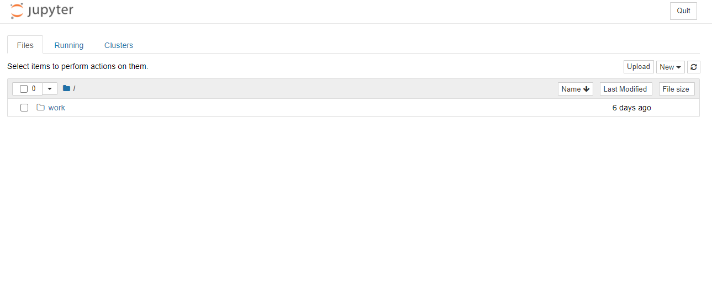

# Hello-Earth

Okay if everything worked as expected you're now a \(not yet completely\) happy owner. And I say not yet completely happy customer because there's not yet any AI tool there.

So, let's ****do a recap, the cluster is up and running but you probably don't know:

1. How to interact with that
2. How to install things on it.

First things first. Do you remember that utility we asked you to download and install named k9s? Okay now just type in your terminal `k9s`and you'll see your Kubernetes cluster appear. To close it down **CTRL+C**

**In case you saw us printing something like `export=/path/path/file` just copy&paste that before typing K9s. That is needed to explain to your laptop how to reach out your freshly installed cluster.**

## **Hello Notebooks**

In order to start playing with AI you need a workspace right? So the first way to get one is using the popular Jupyter Notebooks. 

> **The Jupyter Notebook is an open-source web application that allows you to create and share documents that contain live code, equations, visualizations and narrative text. Uses include: data cleaning and transformation, numerical simulation, statistical modeling, data visualization, machine learning, and much more. -** [**https://jupyter.org/**](https://jupyter.org/)\*\*\*\*

K3ai as an amazing way to get things done that is a simple rule:

**everything need**s **to be done in  no more than 3 steps**

That's why we developed the plugins and group-plugins concept, to take shortcuts and get the job done.

So let's take a look at the option we got first. Type the following in your terminal

```text
k3ai-cli list
```

You should get a result similar to the one below

```text
k3ai-cli list

Name                           Description
argo-workflow                  Argo Workflow plugin
h2o-single                     H2O.ai
jupyter-minimal                Minimal Jupyter Configuration
katib                          Kubeflow Katib
kf-pipelines-tekton            Kubeflow Pipelines based on Tekton
kubeflow-pipelines             Kubeflow Pipelines platform agnostic
mpi-op                         MPI-Operator
nvidia-gpu                     Nvidia GPU support 
pytorch-op                     Pytorch op
tekton                         Kubeflow Pipelines based on Tekton
tensorflow-op                  Kubeflow Tensorflow
...
...
```

That's the list of the current plugins we got, each one represents a single application. Now let's try a different command:

```text
k3ai-cli list -g
```

The result will be different \(something similar to\):

```text
k3ai-cli list -g

Name                           Description
argo-workflow-traefik          Expose Argo Workflow using traefik HTTP
jupyter-minimal-traefik        Expose Jupyter Notebooks using traefik HTTP
katib-traefik                  Expose Katib using traefik HTTP
kf-pipelines-tekton-traefik    Expose Kubeflow pipelines with Tekton backend using traefik HTTP
kubeflow-pipelines-traefik     Expose Kubeflow Workflow using traefik HTTP
pytorch-op-traefik             Expose Pytorch using traefik HTTP
tensorflow-op-traefik          Expose Tensorflow using traefik HTTP
...
...
```

What we asked was: "Hey k3ai give me the list of the group plugins please". What is a group plugin? It's a combination of plugins. For example, let's take our Jupyter Notebook: we want the notebook itself but we also want to publish it through an ingress \(traefik\) so that we may reach out immediately to the application. 

> Kubernetes Ingress builds on top of Kubernetes [Services](https://docs.projectcalico.org/about/about-kubernetes-services) to provide load balancing at the application layer, mapping HTTP and HTTPS requests with particular domains or URLs to Kubernetes services. Ingress can also be used to terminate SSL / TLS before load balancing to the service.

_NOTE: Not all group plugins work with every cluster because not all of them deploy the same configuration to make things easier check the below table a reference._

| Ingress | Where it works out of the box |
| :--- | :--- |
| Traefik | K3s, K3d |
| Calico | K0s |

## Earth call Notebook

Okay, we are ready, let's go for the notebook. Type:

```text
k3ai-cli apply jupyter-minimal
```

Or if you want also the ingress \(like in K3s/k3d\)

```text
k3ai-cli apply -g jupyter-minimal-traefik
```

Once everything has been deployed the notebook is reachable at `http://<YOUR CLUSTER IP>:8888`

Note: if did not use the ingress you have first to expose the port, simply type the following in your terminal to reach it out

```bash
kubectl port-forward -n jupyter deployment/jupyter-minimal 8888:8888
```

Don't close the terminal, open your browser and point yourself to `http://localhost:8888` or `http://<YOUR CLUSTER IP>:8888`

_Note: We do not use authentication for our notebook because we expect you to use if for experimentation but it's a standard configuration so in case head to_ [_**How to build your first plugin**_](../plugins/build-plugins.md) _section to learn how to change that_

If everything went right you should see something similar to this



