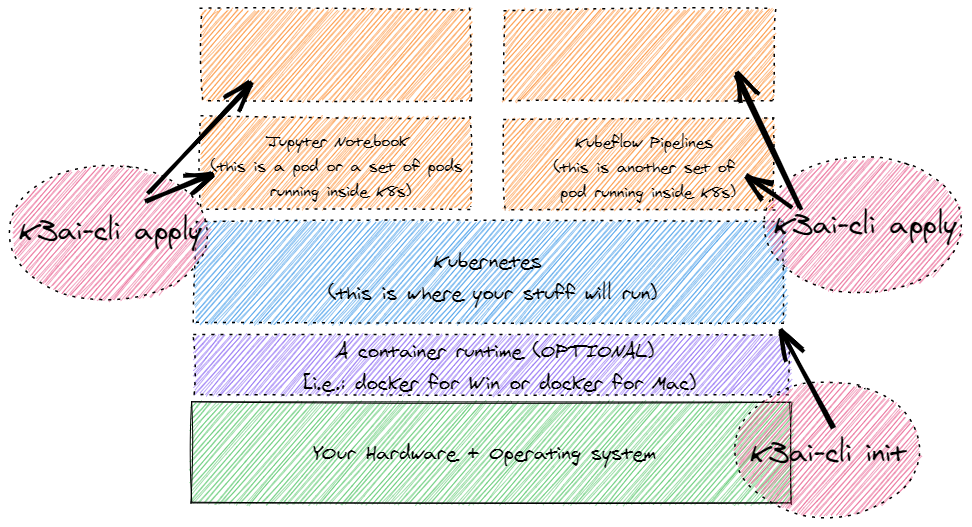

# Hello-Home

## Hello

Let's check if we got everything ready:

* [ ] A laptop/device/server with a minimum of 4 GB of RAM \(if you got 8 is perfect\)
* [ ] Passion for AI in general
* [ ]  30 mins of your time for each section
* [ ] Did you already got `k3ai-cli` installed? If not go to the [QuickStart](../quick-start.md#first-things-first) section
* [ ] kubectl \(don't ask yet just download it  from [**here**\)](https://kubernetes.io/docs/tasks/tools/install-kubectl/)
* [ ] k9s \(you'll thank us later... download it from [**here**](https://github.com/derailed/k9s/releases)\)

Okay if we got everything let's start. We will use `k3ai-cli`  to do everything so you don't really have to learn how to do things over than learn k3ai. The diagram below shows you how the various `k3ai-cli` command will drive you through the Hello\* guides



## First Step

The first step is to learn how to install the cluster \(unless you don't have one already\). K3ai support various configurations:

* Local deployments 
* Cloud deployments

We make use of a configuration file to drive the various installation steps so, while the main goal of K3ai is not to deploy Kubernetes clusters we aim to make the life of our users as simple as possible.

_Note: are you an expert in automation and cluster deployment \(K8s\)? Help us and add some nice tooling to K3ai._

K3ai currently support the following local clusters:

* Rancher K3s - [https://rancher.com/docs/k3s/latest/en/](https://rancher.com/docs/k3s/latest/en/)
* Mirantis K0s - [https://k0sproject.io/](https://k0sproject.io/)
* KinD - [https://kind.sigs.k8s.io/](https://kind.sigs.k8s.io/)
* Rancher K3d - [https://k3d.io/](https://k3d.io/)

On the cloud side we do offer support for:

* Civo Cloud - [https://www.civo.com/kube100](https://www.civo.com/kube100)
* AWS - \(Work In Progress\)

This guide will use the local installation.

## Home

Open a terminal window and simply type the following:

```text
k3ai init
```

What will happen is the following:

1. If it does not exist a folder named `.k3ai` will be created under your home directory \(i.e.: in Linux under /home/yourusername/\) inside this directory we will download a sample `config.yaml` file.
2. The `config.yaml` has a default installation cluster: KinD that requires docker to be installed.
   1. If you don't have docker installed at this point you have to follow this guide [**here**](https://docs.docker.com/get-docker/)\*\*\*\*
   2. **If you don't want to use Kind just go to step 3**
3. If you got docker installed we will deploy Kind automatically and you're ready to move to Hello-Earth. If you don't want kind and/or don't want to install docker keep reading.

## Home  Rebuild

An alternative way to install a cluster and be able to choose the favorite flavor is to use a slightly different command

```text
k3ai init --local <YourClusterFlavor>
```

Let's go into more details here's the full list of options:

* `k3ai init --local k3s`
* `k3ai init --local k0s`
* `k3ai init --local kind`
* `k3ai init --local k3d`

In case of Cloud:

* `k3ai init --cloud civo`

Now to sum it up here's a video that shows how it works.



Home Rebuild - Foundation

As we mentioned at the beginning of this guide k3ai support a config file as well. The config file looks like the one below and is located at &lt;home user folder&gt;/.k3ai/config.yaml but k3ai support also a custom location through `k3ai init --config <yourpath to config file>`

```yaml
# The first two (2) lines are used to indicate what the section does. 
# We use them to group stuff, if you need multi-cluster just copy,paste and 
# rewrite everything after the first 2 lines

kind: cluster 
targetCustomizations: 
# This is what you change typically: name is k3ai internal instance name,
# enabled is to tell k3ai if you want to install it or not
# type means what need to be installed
# config if the cluster flavor has it's own config file (kubeconfig)
- name: localK3s 
  enabled: false # Set it to True to enable the section
  type: k3s 
  config: "/etc/rancher/k3s/k3s.yaml" 
  clusterName: demo-wsl-k3s # This is the name of your cluster 
  clusterDeployment: local 
  # clusterStart is helpful when you install on things like WSL that do not have
  # services etc..
  clusterStart: "sudo bash -ic 'k3s server --write-kubeconfig-mode 644 ...'"
  spec:
  # If the OS is not needed may be removed so the three below
  # are mutually exclusive, if not needed set them to null or remove it
    wsl: "https://github.com/rancher/k3s/releases/download/v1.19.4%2Bk3s1/k3s"
    mac: 
    linux: "https://get.k3s.io | K3S_KUBECONFIG_MODE=644 sh -s -"
    windows: 
    # If you want to add automatically some plugins you may use the group below
  plugins: 
  - repo: #where is your plugin located?
    name: #how it is called?
  - repo: 
    name: 
```

For cloud there a couple of extra configs like the one below

```yaml
- name: remoteK3s 
  enabled: false
  type: k3s
  config: remote #currently we do not copy and merge the kubeconfig
  clusterName: demo-cluster-remote 
  clusterDeployment: cloud #change from local to cloud
  clusterStart: 
  spec:
    wsl: 
    mac: 
    linux:
    windows:
    # Cloud section
    cloudType: civo
    cloudNodes: 1
    cloudSecretPath: $HOME/.k3ai/secret.txt
    # ---end----
  plugins: 
  - repo: 
    name: 
  - repo: 
    name: 
```

Done your Hello Home is ready! You may proceed to the [**Hello-Earth**](hello-earth.md) section

