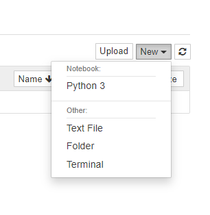
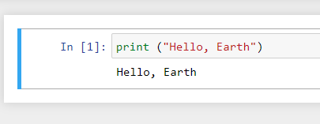
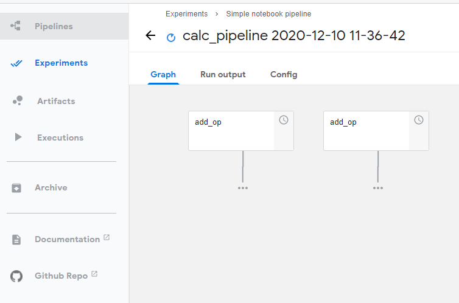

# Hello-Universe

So we got our cluster and we got our Jupyter Notebook ready. Let's practice a bit with that.

## Hello

A Jupyter Notebook is an interactive python environment. It's pretty useful because you may "play" with it. Let's see a couple of examples:

### Print something

1. Open your notebook
2. Click on the option "New" and select "Python 3"



3. In the first cell type:

```text
print ("Hello, Earth")
```

Press CTRL+Enter on your keyboard you should see something similar to the image below.



If you want to learn more about how to use a Jupyter Notebook there's a great user guide on their site, just click [**here**](https://jupyter-notebook.readthedocs.io/en/stable/examples/Notebook/Notebook%20Basics.html)\*\*\*\*

## Hello Universe

So The cluster is up, the notebook is ready it's time to add some spice to the recipe.  Whenever you want to develop a real AI application you will have to take care of three major areas: DataSets, Training, Inference.

DataSet is your data, where it comes from, how you prepare it, where you store it. We do not currently take care of this in k3ai. We focus on model training and model inference.

Model Training is about how you "teach" your mathematical model to identify specifics patterns or provide you results out of your dataset. For the sake of this guide, we will use Kubeflow pipelines for our training.

> Kubeflow Pipelines is a platform for building and deploying portable, scalable machine learning \(ML\) workflows based on Docker containers - [https://www.kubeflow.org/docs/pipelines/overview/pipelines-overview/](https://www.kubeflow.org/docs/pipelines/overview/pipelines-overview/)

So the flow will be this:

1. Add Kubeflow pipelines to our existing cluster
2. Download and use the public Kubeflow minimal pipeline example to learn how to use them
3. Run a slightly more complex pipeline against our fresh Kubeflow pipeline environment

To add Kubeflow pipelines to our existing environment we will type in our terminal

```text
k3ai apply kubeflow-pipelines
```

or if we are in K3s/K30 and we want to make use of traefik

```text
k3ai apply -f kubeflow-pipelines-traefik
```

Once the deployment is done we may reach out to the pipelines UI on port 80. In case we did not use traefik we may expose the UI with this command:

```text
kubectl port-forward -n kubeflow svc/ml-pipeline-ui 8080:80
```

Now let's proceed to download a sample notebook from the Kubeflow repo.  You may grab it from [**here**](https://github.com/kubeflow/examples/tree/master/pipelines/simple-notebook-pipeline)\*\*\*\*

Open the notebook in raw mode, select all and save it as file with .ipynb  extension \(i.e.: demo.ipynb\)

1. Open your Jupyter Notebook UI \(http://&lt;YOUR CLUSTER IP&gt;:8888\)
2. Click on Upload and load the Notebook you just saved
3. Once the Notebook has been upload it open it
4. Execute the first cell to install KFP SDK library. This is needed to interact with Kubeflow pipelines
5. In another tab of your browser open the Kubeflow UI \(http://&lt;YOUR CLUSTER IP&gt;:8888
6. Now let's move to the cell as the one below

```python
# Specify pipeline argument values
arguments = {'a': '7', 'b': '8'}
# Launch a pipeline run given the pipeline function definition
kfp.Client().create_run_from_pipeline_func(calc_pipeline, arguments=arguments, 
                                           experiment_name=EXPERIMENT_NAME)
# The generated links below lead to the Experiment page and the pipeline run...
```

and change it to

```python
# Specify pipeline argument values
arguments = {'a': '7', 'b': '8'}
# Launch a pipeline run given the pipeline function definition
kfp.Client("<YOUR CLUSTER IP>").create_run_from_pipeline_func(calc_pipeline, arguments=arguments, 
                                           experiment_name=EXPERIMENT_NAME)
# The generated links below lead to the Experiment page and the pipeline run...
```

That's all.. execute all cells one after another and you'll see after the cell we just changed a result similar to this


At this point click on the "Run Details" and you should see something like this



Congratulation you have now a full pipeline running on your k3ai playground!

